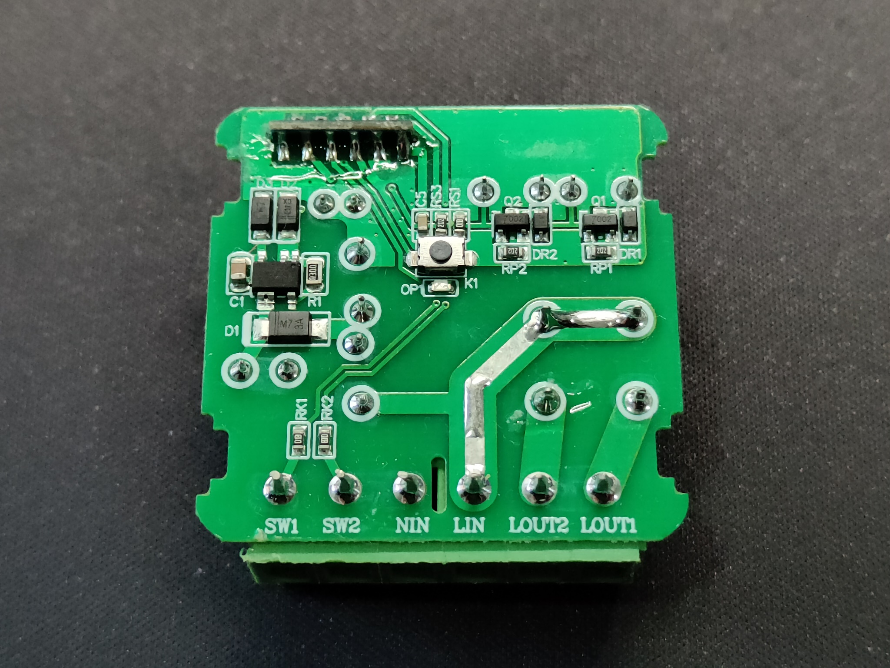
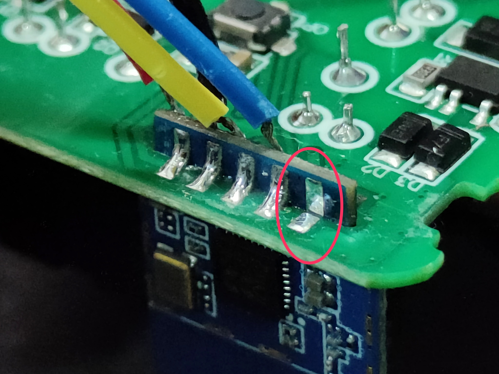
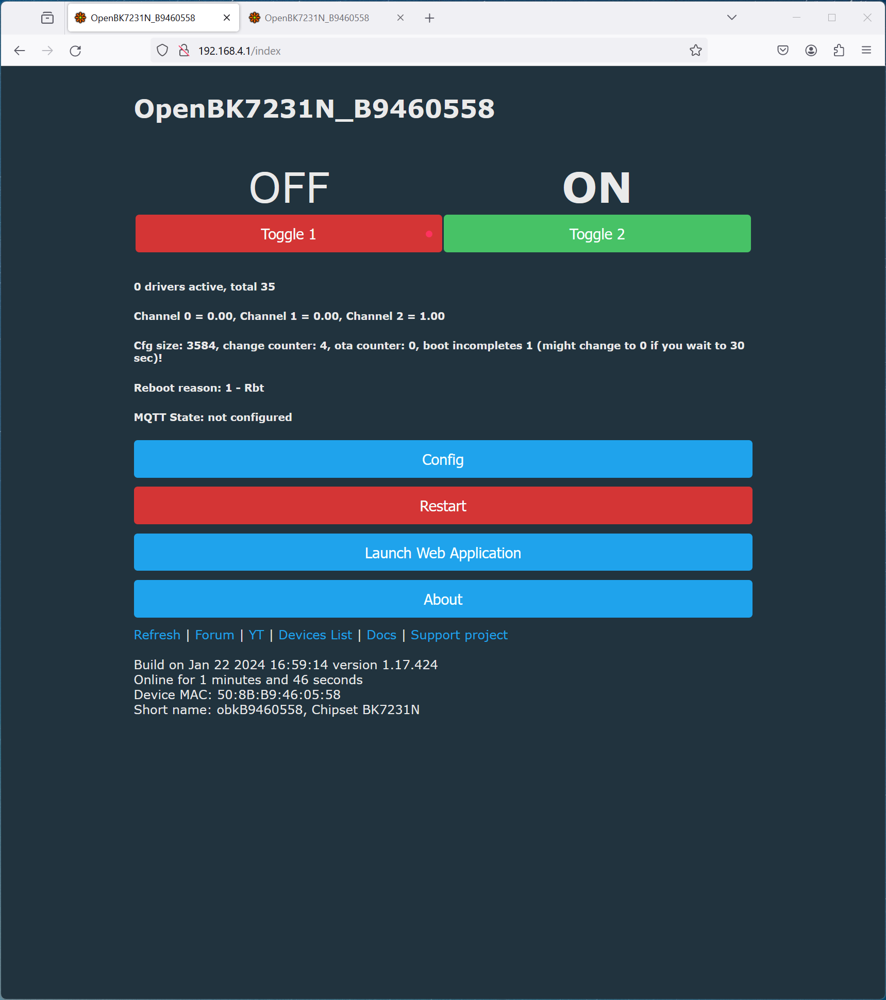

# Flash MINI-W1-2CH with OpenBK7231N


This tutorial aims to transform the smart switch device from the brand (Tuya/Aubess) into a generic one, allowing it to be compatible, for instance, with HomeAssistant using mqtt.

The device has no manufacturer, neither on it nor on the box, it just says model MINI-W1-2CH.
This is based on the BK7231N cb2s system and has been flashed with the latest OpenBK7231N firmware using  [BK7231GUIFlashTool](https://github.com/openshwprojects/BK7231GUIFlashTool).

The housing is assembled with 4 latches that can be easily released when lifted.
Programming can be done without the need for desoldering the module, however, you need to desoldering temporarily the CEN pin.

## Photos




## Requirements
* Tuya WIFI 2 Gang Smart Switch Module 2 Way [Link](https://s.click.aliexpress.com/e/_DESCCPB)
* Converter UART - USB to TTL [Link](https://s.click.aliexpress.com/e/_DCpKHXb)
* Soldering Iron
* Wires
  
## Pinout


## Soldering

Solder carefully 4 wires to the following pins on the cb2s module as shown in the table below. 
It will also be necessary to temporarily desolder the CEN pin while programming the switch. In the end, it is necessary to solder the CEN pin back again.
Please note that the RX pin of the switch should be connected to the TX pin of the USB to TTL module, and the TX pin of the switch to the RX pin of the USB to TTL module."

| CB2S  | USB TO TTL |
| --- | --- |
| 3v3 | 3V3 |
| GND | GND |
| RX1 | TXD |
| TX1 | RXD |




## Flash

1. Download the last release of flash tool [here](https://github.com/openshwprojects/BK7231GUIFlashTool/releases).
2. Plug the UART Converter on USB port.
3. Select the COM Port.
4. Select chip type `BK7231N`.
5. Click on the button `Download latest from web`.
6. Select the last firmware.
7. Click on the button `Do backup and flash new`.


## Configuration

1. Connect the module to power through the L-in and N-in pins.
2. Search for the Wi-Fi network being broadcasted by the switch and connect to it.
3. Open the browser and navigate to: `http://192.168.4.1`.
4. Click on the `Launch Web Application` button.
5. In the `Import` tab, copy and paste the code you can find below and click `Clear OBK and apply new script from above`.
6. Return to the address `http://192.168.4.1` and now you can interact with the device.

```
{
  "vendor": "Tuya",
  "bDetailed": "0",
  "name": "MINI-W1 2-Gang WiFi Switch Module",
  "model": "MINI-W1-2CH",
  "chip": "BK7231N",
  "board": "PSW3-23v3B",
  "flags": "1024",
  "keywords": [
    "TODO",
    "TODO",
    "TODO"
  ],
  "pins": {
    "6": "TglChanOnTgl;1",
    "7": "TglChanOnTgl;2",
    "10": "Rel;1",
    "11": "WifiLED_n;0",
    "23": "Btn_Tgl_All;0",
    "24": "Rel;2"
  },
  "command": "",
  "image": "https://raw.githubusercontent.com/ruigaspar/Flash_MINI-W1-2CH_with_OpenBK7231N/master/images/MINI-W1-2CH.jpg",
  "wiki": "https://github.com/ruigaspar/Flash_MINI-W1-2CH_with_OpenBK7231N"
}
```





---

<a href="https://www.buymeacoffee.com/ruigaspar" target="_blank"></a>
