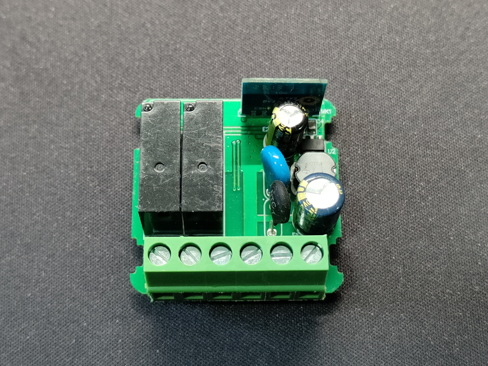

# Flash MINI-W1-2CH with OpenBK7231N


This tutorial aims to convert the brand's base smart switch device (tuya) into a generic one to be used, for example, with HomeAssistant over mqtt.

The device has no manufacturer, neither on them nor on the box. Only the general model is MINI-W1-2CH.
This is based on the BK7231N cb2s system and flashed with the last OpenBK7231N firmware by [BK7231GUIFlashTool](https://github.com/openshwprojects/BK7231GUIFlashTool).

The housing is assembled with 4 latches, which release quite easily when lifted. 
You can program without desoldering the module, but you need to desoldering temporarily the CEN pin.

## Photos




## Requirements
* Tuya WIFI 2 Gang Smart Switch Module 2 Way [Link](https://s.click.aliexpress.com/e/_DESCCPB)
* Converter UART - USB to TTL [Link](https://s.click.aliexpress.com/e/_DCpKHXb)
* Soldering Iron
* Wires
  
## Pinout


## Soldering

| CB2S  | USB TO TTL |
| --- | --- |
| 3v3 | 3V3 |
| GND | GND |
| RX1 | TXD |
| TX1 | RXD |


## Flash

1. Download the last release of flash tool [here](https://github.com/openshwprojects/BK7231GUIFlashTool/releases).
2. Plug the UART Converter on USB port.
3. Select the COM Port.
4. Select chip type `BK7231N`.
5. Click on the button `Download latest from web`.
6. Select the last firmware.
7. Click on the button `Do backup and flash new`.


## Configuration
```
{
  "vendor": "Tuya",
  "bDetailed": "0",
  "name": "MINI-W1 2-Gang WiFi Switch Module",
  "model": "MINI-W1-2CH",
  "chip": "BK7231N",
  "board": "PSW3-23v3B",
  "flags": "1024",
  "keywords": [
    "TODO",
    "TODO",
    "TODO"
  ],
  "pins": {
    "6": "TglChanOnTgl;1",
    "7": "TglChanOnTgl;2",
    "10": "Rel;1",
    "11": "WifiLED_n;0",
    "23": "Btn_Tgl_All;0",
    "24": "Rel;2"
  },
  "command": "",
  "image": "https://raw.githubusercontent.com/ruigaspar/Flash_MINI-W1-2CH_with_OpenBK7231N/master/images/MINI-W1-2CH.jpg",
  "wiki": "https://github.com/ruigaspar/Flash_MINI-W1-2CH_with_OpenBK7231N"
}
```


